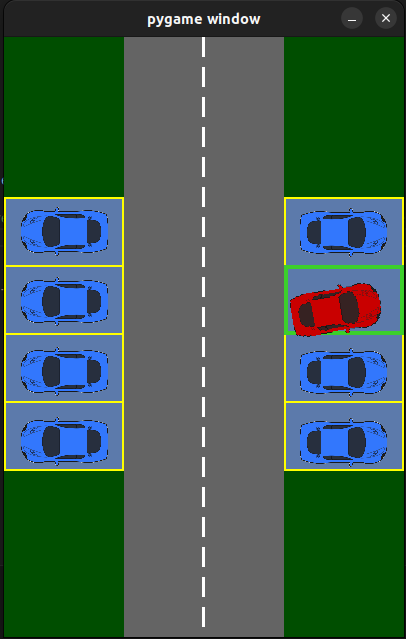

# Autopark
  A smart technology enabling cars to park themselves safely and efficiently.



## Overview

This project utilizes a Reinforcement Learning (RL) based agent to train a self-parking car. The car can perform different types of parking maneuvers such as perpendicular and parallel parking. The goal is to create an autonomous system that can effectively park a vehicle in a designated space without human intervention.

## Getting Started

Follow these instructions to set up the project on your local machine for development and testing purposes.

### Prerequisites

Make sure you have Python installed on your system. You can download it from [python.org](https://www.python.org/).

### Clone the repository

```bash
 git clone https://github.com/TejoVK/Self-Car-Parking.git
```

### Set Up a Virtual Environment

It is recommended to create a virtual environment to manage dependencies:

```bash
python3 -m venv .venv
source .venv/bin/activate
```

### Install Dependencies

Install the required Python packages using `pip`:

```bash
pip install -r requirements.txt
```

## Running the Application

You can run the application to see the self-parking car in action. There are two scripts available: one for perpendicular parking and another for parallel parking.

### Perpendicular Parking

To run the perpendicular parking simulation:

```bash
python3 perpend.py
```

### Parallel Parking

To run the parallel parking simulation:

```bash
python3 game.py
```

## Contributing

Contributions are welcome! Please fork the repository and create a pull request with your changes.

## License

This project is licensed under the MIT License - see the [LICENSE](LICENSE) file for details.

## Contact

If you have any questions or suggestions, feel free to open an issue or contact the repository owner.
